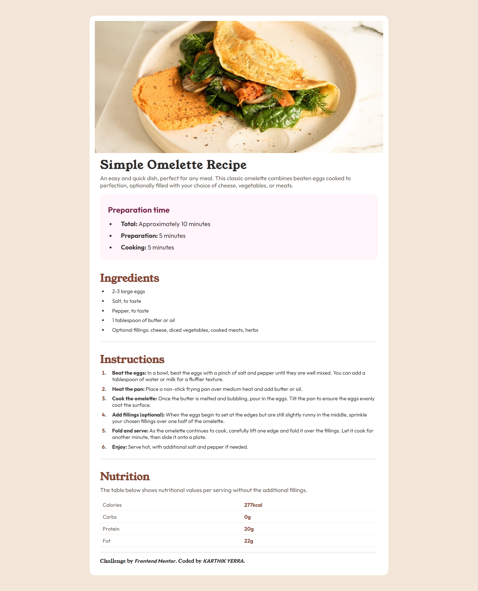
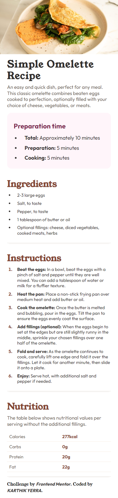

# Frontend Mentor - Recipe page solution

This is a solution to the [Recipe page challenge on Frontend Mentor](https://www.frontendmentor.io/challenges/recipe-page-KiTsR8QQKm). Frontend Mentor challenges help you improve your coding skills by building realistic projects.

## Overview

### Screenshot

# Desktop Preview Screenshot

# Mobile Preview Screenshot

### Links

- Solution URL:
- Live Site URL: https://omelette-receipe-page.netlify.app/

## My process

### Built with

- Semantic HTML5 markup
- CSS custom properties
- Mobile-first workflow
  **Note: These are just examples. Delete this note and replace the list above with your own choices**

## Author

- Frontend Mentor - [@Karthikyerra](https://www.frontendmentor.io/profile/Karthikyerra)
